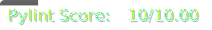

[](./.util/pytest_scores.json)
[](./.util/pylint_scores.json)

# 🌱 Liverpool Museum of Natural History's Plant Monitoring System

## 🔎 Overview 

### 📝 Description
> Welcome to Kelpie's project revolving around the creation of a system for the LMNH which will monitor their plants in their botanist wing, based off readings of different metrics regarding plant health.

### 👩‍💼 Stakeholder Requirements
- Monitor the health of the plants overtime.
- Alert the gardeners if a problem occurs.

### 🎯 Deliverables
- A full data pipeline, hosted in the cloud.
- A short term database solution that can store the data for the past 24 hours.
- A long term storage solution for all data older than 24 hours.
- Some form of visualisation for the data.


## ✏️ Design

### 📏 Entity-Relationship diagram

### 📐 Architecture diagram


## ✅ Getting Started

### 💿 Installations
The following languages/softwares are required for this project. Things assigned as optional are only required if you desire to host this system on the cloud.
- Python
- Bash
- Terraform (Optional)
- Docker (Optional)

### ❗️ Dependencies
There are various folders for each part of the project. In order to run the scripts in each folder, you will need to install the required libraries. This can be done using the code provided below:
```
python3 -m venv .venv
source .venv/bin/activate
pip install -r requirements.txt
```

### 🏃‍♂️‍➡️ Running the scripts
All the scripts only require basic commands to be executed. Different commands are used depending on the software. Ensure that you are in the directory of the file you want to run before using these commands.
```
# Python
python3 "script.py"

# Bash
bash "script.sh"

# Terraform
terraform init
terraform apply
yes

# Docker
docker build -t "image"
docker run --env-file .env -t "image: tag"
```
#### **IMPORTANT**
 One thing to note is that the majority of scripts use environment variables. Make sure to create your own .env and fill out all the variables required to run the code successfully.

## 🚨 Help
<p> Common issues which people face are:</p>

- Not setting up environment variables correctly - you need to ensure that you have done the following: 
  - Create .env file for python scripts or a terraform.tfvars for terraform scripts
  - Create the file in the same directory as the file you want to run
  - Make sure the variable names in your file are the same as the ones used in the script that you would like to run.

- Error encountered with pymssql. This is a common error due to the library not installing itself properly. First, ensure that you have installed both freetds and sqlcmd on your system. If this doesn't work, doing the following steps should fix this problem:
  1. Uninstall pymssql
  2. Delete your .venv
  3. Remove pymssql from your requirements.txt
  4. Create a new .venv and install the requirements
  5. Manually install pymssql using pip install

- For any other problems, make sure to reach out and contact us so we can support you further.


## 📖 Authors
- https://github.com/alina-101
- https://github.com/BerkayDur
- https://github.com/joe1606
- https://github.com/Lasped13

## Version History
- 1.0
  - Initial release

## ™️ License

## Acknowledgements