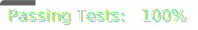

[](./.util/pytest_scores.json)
[](./.util/pylint_scores.json)

# 🌱 Liverpool Museum of Natural History's Plant Monitoring System


## 🔎 Overview 

### 📝 Description
> Welcome to Kelpie's project revolving around the creation of a system for the LMNH which will monitor their plants in their botanist wing, based off readings of different metrics regarding plant health.

### 👩‍💼 Stakeholder Requirements
- Monitor the health of the plants overtime.
- Alert the gardeners if a problem occurs.

### 🎯 Deliverables
- A full data pipeline, hosted in the cloud.
- A short term database solution that can store the data for the past 24 hours.
- A long term storage solution for all data older than 24 hours.
- Some form of visualisation for the data.


## ✏️ Design

### 📏 Entity-Relationship Diagram


This diagram explicitly shows how the data from the readings is stored in the database. We have decided to use a **STAR Schema** for our database due to the requirements of the project. As we only care about the data from the readings and don't worry too much about all the other data, this seemed like a better alternative rather than doing it in a normalised 3NF diagram. This method of schema allows us to quickly extract the reading data from the database and use it which is important when working with EventBridges that trigger every minute.

### 📐 Architecture diagram


- **ETL Pipeline**
  1. EventBridge which triggers every minute.
  2. ETL pipeline python script stored in the ECR.
  3. Lambda function is triggered which runs the script from the ECR and retrieves the data from the API endpoint.
  4. Stores the readings produced from the Lambda function into the Microsoft SQL Server database.

- **Dashboard**
  1. ECR contains the python script for the dashboard.
  2. Fargate task which runs continuously hosting a streamlit dashboard.
  3. The dashboard reads data from the S3 bucket.
  4. Stakeholders can view the dashboard online to see data on their plants.

- **Notifying**
  1. EventBridge which triggers every minute.
  2. Script that checks for anomalies in data is stored in the ECR.
  3. Lambda function reads data from the Microsoft SQL Server database to calculate the mean values of the plants and compares the latest readings to see if there are anomalies.
  4. Upon detecting anomalies, SNS is used to send emails to the gardeners to inform them.

- **Data Movement**
  1. EventBridge which triggers daily.
  2. ECR which contains the python script to extract the daily data.
  3. ECS Fargate task that runs the script from the ECR whenever the event bridge is triggered.
  4. Stores the resultant file from the task into the S3 bucket.


## ✅ Getting Started

### 💿 Installations
The following languages/softwares are required for this project. Things assigned as optional are only required if you desire to host this system on the cloud.
- Python
- Bash
- Terraform (Optional)
- Docker (Optional)

### ❗️ Dependencies
There are various folders for each part of the project. In order to run the scripts in each folder, you will need to install the required libraries. This can be done using the code provided below:
```
python3 -m venv .venv
source .venv/bin/activate
pip install -r requirements.txt
```

### 🏃‍♂️‍➡️ Running the scripts
All the scripts only require basic commands to be executed. Different commands are used depending on the software. Ensure that you are in the directory of the file you want to run before using these commands.
```
# Python
python3 "script.py"

# Bash
bash "script.sh"

# Terraform
terraform init
terraform apply
yes

# Docker
docker build -t "image"
docker run --env-file .env -t "image: tag"
```
#### **IMPORTANT**
 One thing to note is that the majority of scripts use environment variables. Make sure to create your own .env/.tfvars and fill out all the variables required to run the code successfully. Below are all the variable names:
- `ACCESS_KEY`
- `SECRET_ACCESS_KEY`
- `CLUSTER_ARN`
- `DB_PASSWORD`
- `DB_USER`
- `DB_NAME`
- `DB_SCHEMA`
- `NUM_PLANTS`
- `API_URL`
- `ANOMALY_THRESHOLD`
- `COUNT_TO_BE_ANOMALY`
- `SNS_ARN`
- `TIME_FRAME`
- `BUCKET`
- `FILE_NAME`


## 🚀 Running the Repository

### 🗂️ Repository Structure
There are several directories within the repository to keep it organised. Each directory deals with a different part of the project.

- `dashboard` - Contains all the scripts required to run analytics dashboard regarding the plants at the museum.
- `data_movement` - Contains the script which creates a parquet file of all the readings received from the museum within the last 24 hours.
- `notify_anomalies` - Contains the script which detects anomalies in the readings from the database and alerts the gardeners when they occur.
- `pipeline` - Contains all the scripts involved in creating the ETL pipeline for the museum. This results in clean data from the readings being inserted into the database.
- `schema` - Contains the schema used to create the database which is hosted in the Microsoft SQL Server.
- `terraform` - Contains the main terraform script used to host the project on the cloud.

### ☁️ Cloud Resources
For this project, we have designed it with the intention of hosting everything on the cloud in order to automate it. The python scripts can still be ran locally but the terraform scripts have been included within the repository if you desire to host this system on the cloud as well. The cloud service that has been used is **AWS**.

### 📊 Dashboard

The [dashboard](http://18.170.41.129:8501) can be found here which contains summaries and findings on the readings provided by the museum. Below is the information provided by the dashboard:
- *Latest temperature and soil moisture readings* for each plant shown as bar charts.
- Line graphs showing *recent changes* in readings for each plant.
- Line graphs showing the *historical data* for each plant.
- Pie charts providing analysis on the *origins of plants*.
- Map showing the *part of the world* where each plant has come from.


## 🚨 Help
<p> Common issues which people face are:</p>

- Not setting up environment variables correctly - you need to ensure that you have done the following: 
  - Create .env file for python scripts or a terraform.tfvars for terraform scripts
  - Create the file in the same directory as the file you want to run
  - Make sure the variable names in your file are the same as the ones used in the script that you would like to run.

- Error encountered with pymssql. This is a common error due to the library not installing itself properly. First, ensure that you have installed both freetds and sqlcmd on your system. If this doesn't work, doing the following steps should fix this problem:
  1. Uninstall pymssql
  2. Delete your .venv
  3. Remove pymssql from your requirements.txt
  4. Create a new .venv and install the requirements
  5. Manually install pymssql using pip install

- For any other problems, make sure to reach out and contact us so we can support you further.


## 📖 Authors
- https://github.com/alina-101
- https://github.com/BerkayDur
- https://github.com/joe1606
- https://github.com/Lasped13


## 📚 Version History
- 1.0
  - Initial release


## © License
This project is licensed under the alina101, BerkayDur, joe1606, Lasped13 - see the LICENSE.md file for details.


## ❤️ Acknowledgements
- 🚜 **Gardeners** at the LMNH for taking care of the plants.
- 🧡 **Sigma Labs** for giving us this project.
- 🤖 **Sigma Bot** for helping us with the project.
- 🦕 **LMNH** for promoting agriculture and botany in the UK.